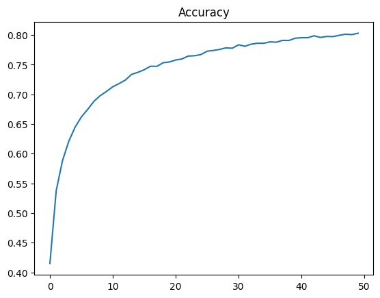

# 📚 Mes Projets Deep Learning

Bienvenue dans mon espace de projets Deep Learning !
J’explore ici différentes familles de réseaux de neurones appliquées à des problématiques concrètes : classification, régression, vision, génération, séquences temporelles, et apprentissage par renforcement.

---

## 🚀 Projets inclus

1. 🔵 [Perceptrons Multi-Couches (PMC)](#1--perceptrons-multi-couches-pmc)
2. 🧠 Modèles Convolutifs (CNN) *()*
3. 🎯 Reinforcement Learning (DQN, PPO) *(bientôt)*
4. 🔁 Modèles Récurrents (RNN, LSTM, GRU) *(bientôt)*
5. 🎨 Modèles Génératifs (GAN, VAE) *(bientôt)*
6. ✨ Modèles à Attention / Transformers *(bientôt)*

---

## 1. 🔵 Perceptrons Multi-Couches (PMC)

> Réseaux de neurones feedforward utilisés pour des tâches de classification et de régression supervisées. Tous les modèles sont construits avec **Keras (TensorFlow)**.

---

### 📁 Projet 1 : Prédiction de la Performance des Employés

* **Données :** `employee_performance.csv`
* **Objectif :** classifier la performance des employés à partir de variables RH (age, expérience, etc.)
* **Modèle :**

  * Architecture : `8 → 64 → 32 → 1 (sigmoid)`
  * Fonction de perte : Binary Crossentropy
* **Résultats :**

  * 🌟 Accuracy test : **99.83%**
  * 📉 Loss test : **0.0044**

📊 **Courbes d’entraînement :**


---

### 📁 Projet 2 : Prédiction de la Hauteur de Tir Balistique

* **Données :** `balistic.csv`
* **Objectif :** prédire la hauteur atteinte par un tir selon des paramètres physiques (angle, vitesse, etc.)
* **Modèle :**

  * Architecture : `12 → 64 → 32 → 1 (linéaire)`
  * Fonction de perte : MSE
* **Résultats :**

  * 📉 Loss test : **0.1198**
  * 📈 R² : **0.99997**

📊 **Courbe de la perte pendant l’entraînement :**


---

### 📁 Projet 3 : Classification de Maladies

* **Données :** `maladies.csv`
* **Objectif :** classifier une maladie à partir de 12 symptômes encodés.
* **Modèle :**

  * Architecture : `12 → 64 → 10 (softmax)`
  * Fonction de perte : Categorical Crossentropy
* **Résultats :**

  * 📊 Accuracy entraînement : **97.3%**
  * ⚠️ **Problème identifié :**
    Les maladies ont exactement les mêmes symptômes, ce qui rend la classification impossible malgré un bon score.

📉 **Exemple de résultat (fausse performance) :**


---


## 2. 🧠 Modèles Convolutifs (CNN)

> Réseaux de neurones convolutifs utilisés pour la reconnaissance d’images. Modèles construits avec **Keras (TensorFlow)**.

---

### 📁 Projet 1 : Classification MNIST (Chiffres manuscrits)

* **Données :** MNIST (28x28 images en niveaux de gris, 10 classes)
* **Prétraitement :** one-hot encoding des labels
* **Modèle :**

  * 3 couches Conv2D + MaxPooling
  * Dense final avec softmax pour classification
* **Résultats :**

  * 📊 Accuracy finale : **99.4%**
  * 📉 Loss finale : environ **0.0174**

📊 **Courbes d’entraînement :**

  


---

### 📁 Projet 2 : Classification CIFAR-10 (Images couleur 32x32)

* **Données :** CIFAR-10 (60000 images couleur, 10 classes)
* **Prétraitement :** one-hot encoding des labels
* **Modèle :**

  * 3 couches Conv2D + BatchNormalization + Dropout
  * Dense final avec softmax
* **Résultats :**

  * 📊 Accuracy finale : **~78%**
  * 📉 Loss finale : **~0.68**

📊 **Courbes d’entraînement :**

  



---

## ▶️ Comment utiliser ce projet

### 1. **Cloner le dépôt**

```bash
git clone git@github.com:NdongoMamoudou/DeepLearningHub.git
cd Projet_DeepLearning
```

### 2. **Créer un environnement virtuel (recommandé)**

```bash
python -m venv venv
source venv/bin/activate  # Linux/Mac
venv\Scripts\activate     # Windows
```

### 3. **Installer les dépendances**

```bash
pip install -r requirements.txt
```


### 4. **Exécuter un projet**

Va dans un dossier de projet PMC et exécute le notebook correspondant. Exemple :

```bash
cd PMC/Projet_1_Performance
jupyter notebook Projet_1_Employe_Performance.ipynb
```

Ou exécute directement un script Python s’il y en a un :

```bash
python main.py
```

---

## 📆 Structure du dépôt

```
Projet_DeepLearning/
├— PMC/
│   ├— Data/
│   ├— Projet_1_Performance/
│   ├— Projet_2_Balistique/
│   └— Projet_3_Maladies/
├— images/
│   ├— performance_loss_accuracy.png
│   ├— balistique_loss.png
│   └— maladies_result.png
└— README.md
```

---

## 🛠️ Outils et Librairies

* **Python**
* **Pandas**, **NumPy**, **Scikit-learn**
* **TensorFlow / Keras**
* **Matplotlib**, **Seaborn** *(optionnel)*

---

## 📌 Contact

Tu veux échanger, poser une question ou proposer une amélioration ?
📧 \[[TonEmail@exemple.com](mailto:TonEmail@exemple.com)]
🔗 [LinkedIn](https://linkedin.com/in/tonprofil) *(optionnel)*
